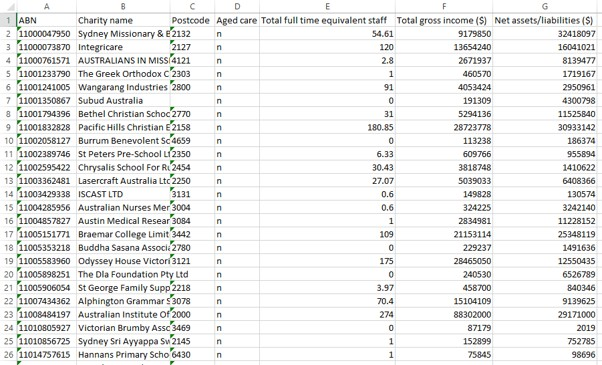
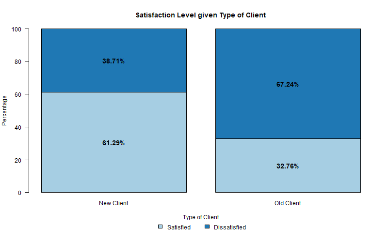
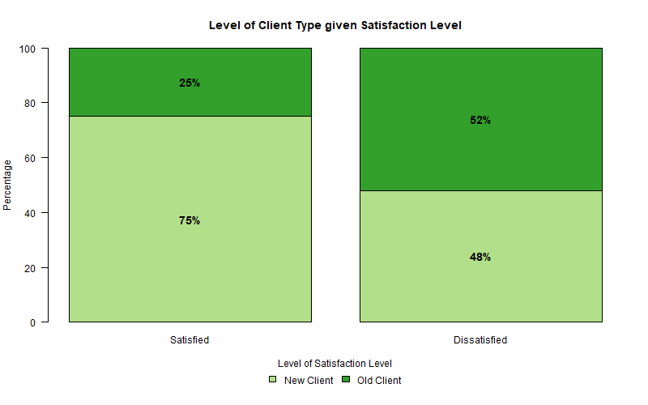
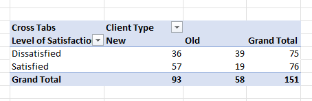
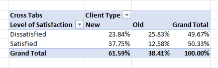
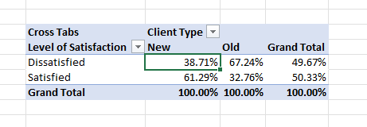
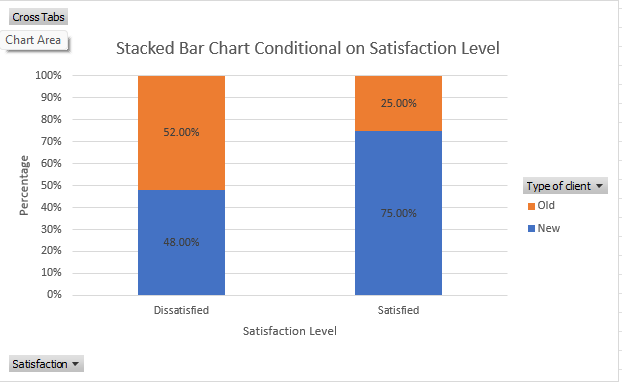

# Module 1

<!-- ====== COLOURED BANNER ====== -->

<div style="
  background: linear-gradient(90deg, #e6f0ff, #f7fbff);
  border-left: 8px solid #2a7ae2;
  padding: 18px;
  border-radius: 6px;
  margin: 20px 0;
">
  <strong style="color:#1a4f8b; font-size:1.1em;">
    Module Focus: Introducing the foundational ideas
  </strong>
  <p style="margin-top:8px;">The focus is on understanding what data are, how they are collected, and how they should be summarised and interpreted responsibly.</p>
  
</div>
<!-- ====== END BANNER ====== -->

## Variables, Types of Data, and Sampling

Understanding data begins with understanding variables.

**Statistical terminology**

- **Cases**: the individuals or objects being studied
- **Variables**: characteristics measured on each case
- **Data**: the observed values of the variables

**Types of data**

| Data type | Description | Examples |
|---------|------------|----------|
| Quantitative | Numerical values with meaningful units | Height (cm), pulse rate |
| Categorical (Nominal) | Categories with no natural order | Gender, faculty |
| Ordinal | Categories with a natural order | Likert scale responses |
| Identifier | Unique labels for each case | Student number |

Categorical variables are often **coded numerically** in software, but the numbers themselves have no numerical meaning.

**Populations and Sampling**
Because studying an entire population is usually impractical, statistics relies on samples. Valid conclusions depend on three key ideas:

1. **Sampling** – samples should be representative of the population.

2. **Randomising** – random selection reduces bias and allows generalisation.

3. **Sample size** – larger samples tend to give more accurate results, but at higher cost.

Only **random samples** support valid statistical inference.

---

## Visualising Data: One Categorical Variable

The **distribution of a variable** describes what values it takes and how often they occur. Graphs allow large amounts of data to be summarised clearly and patterns to be identified.

**Numerical summaries**

- Frequency tables for categorical variables
- Use pivot tables in Excel

**Bar charts**

- Used for **categorical variables**
- Bars do **not** touch
- Order bars logically (alphabetical or by size)

**Pie charts**

- Not recommended as difficult for the reader to fully understand
- Show **parts of a whole**
- Must include all categories (total = 100%)
- Best used sparingly and with few categories

---

## Contingency Tables 

When analysing **two categorical variables**, we use a **contingency table** (also called a two-way table or cross-tabulation).

**Types of distributions**

- **Joint distribution**: proportions of all cases in each cell
- **Marginal distribution**: proportions for one variable only (row or column totals)
- **Conditional distribution**: proportions within a subgroup

**Assessing association**

Two categorical variables are **associated** if the conditional distributions differ between groups. If the conditional distributions are similar, the variables are considered **independent**.

**Graphical support**

- **Stacked bar charts** are useful for comparing conditional distributions visually.


<div style="
  background: #f0fff4;
  border-left: 8px solid #2a9d8f;
  padding: 18px;
  border-radius: 6px;
  margin: 20px 0;
">
  <strong style="color:#1b7f5f; font-size:1.1em;">
    💡 To assess association:
  </strong>
  <p style="margin-top:8px;">Always compare **conditional distributions**, not just raw counts.</p>
  
</div>
---

## Use, Abuse, and Misuse of Statistics

Statistics are powerful, but they can be misleading if used poorly or dishonestly.

**Key ideas**

- Results can be **misinterpreted** through poor sampling or misleading summaries.
- Graphs can strongly influence interpretation depending on:
  - scale and axis limits
  - graph type
  - use of 3D effects or distorted perspectives

**Good data visualisation principles**

- Match the graph type to the **data type**
- Label axes clearly (variable names and units)
- Use honest scales (usually starting at zero)
- Avoid unnecessary decoration (especially 3D graphs)
- Aim to **tell the truth** and communicate clearly


<div style="
  background: #f0fff4;
  border-left: 8px solid #2a9d8f;
  padding: 18px;
  border-radius: 6px;
  margin: 20px 0;
">
  <strong style="color:#1b7f5f; font-size:1.1em;">
    💡 A graph is only as good as the data it displays.
  </strong>
  <p style="margin-top:8px;">No amount of visual design can fix poor or biased data.</p>
  
</div>
 

---

# Review Questions: Module 1 {-}

<div style="
  background: linear-gradient(90deg, #e6f0ff, #f7fbff);
  border-left: 8px solid #2a7ae2;
  padding: 18px;
  border-radius: 6px;
  margin: 20px 0;
">
  <strong style="color:#1a4f8b; font-size:1.1em;">
    Review Questions
  </strong>
  <p style="margin-top:8px;">Once you have watched the lecture recordings you should be able to answer the following *Threshold* questions (solutions can be found at the end of this Workbook).</p>
  
</div>


<!-- HTML VERSION -->
```{=html}

<style>
  .revq { max-width:900px; margin:0 auto; }
  .revq .muted { color:#666; font-size:.9rem; }
  .revq-row { display:grid; grid-template-columns: 1fr 120px; gap:10px; align-items:start; margin:.6rem 0; }
  .revq textarea { width:100%; min-height:3.2rem; padding:6px; box-sizing:border-box; }
  .revq .chk { display:flex; align-items:center; gap:.5rem; }
  .revq .btn { padding:6px 10px; border:1px solid #ccc; border-radius:4px; background:#f7f7f7; cursor:pointer; }
  .revq .btn + .btn { margin-left:.4rem; }
  .revq-answers { background:#f6fbff; border-left:6px solid #2b8cbe; padding:.9rem 1rem; border-radius:6px; margin-top:.8rem; display:none; }
  .revq-answers h5 { margin:.2rem 0 .5rem; font-size:1.05rem; }
  .revq-answers p { margin:.4rem 0; }
</style>

<div class="revq" id="revq">
  <p class="muted">
    Write your answers in the boxes below. Tick the checkbox if you believe your answer is correct.
    Click <em>Show model answers</em> to compare.
  </p>

  (i) What is a variable? What is a value of a variable? Give examples.
  <div class="revq-row">
    <textarea id="revq_m1_q1" placeholder="Your answer…"></textarea>
    <label class="chk"><input type="checkbox"> Marked correct</label>
  </div>

  (ii) How can we tell if a variable is quantitative, categorical, ordinal, or an identifier?
  <div class="revq-row">
    <textarea id="revq_m1_q2" placeholder="Your answer…"></textarea>
    <label class="chk"><input type="checkbox"> Marked correct</label>
  </div>

  (iii) What is the difference between cross-sectional and time series data?
  <div class="revq-row">
    <textarea id="revq_m1_q3" placeholder="Your answer…"></textarea>
    <label class="chk"><input type="checkbox"> Marked correct</label>
  </div>

  (iv) What is the difference between a representative sample and a convenience sample? Advantages/disadvantages?
  <div class="revq-row">
    <textarea id="revq_m1_q4" placeholder="Your answer…"></textarea>
    <label class="chk"><input type="checkbox"> Marked correct</label>
  </div>

  (v) What is a contingency (two-way) table? When is it used?
  <div class="revq-row">
    <textarea id="revq_m1_q5" placeholder="Your answer…"></textarea>
    <label class="chk"><input type="checkbox"> Marked correct</label>
  </div>

  (vi) What is meant by a marginal, joint, and conditional distribution?
  <div class="revq-row">
    <textarea id="revq_m1_q6" placeholder="Your answer…"></textarea>
    <label class="chk"><input type="checkbox"> Marked correct</label>
  </div>

  (vii) List three things that may result in a bad graph.
  <div class="revq-row">
    <textarea id="revq_m1_q7" placeholder="Your answer…"></textarea>
    <label class="chk"><input type="checkbox"> Marked correct</label>
  </div>

  <div style="margin-top:.6rem;">
    <button class="btn" id="revq-show">Show model answers</button>
    <button class="btn" id="revq-hide" style="display:none;">Hide model answers</button>
    <button class="btn" id="revq-reset">Reset</button>
  </div>

  <div class="revq-answers" id="revq-model">
    <h5>Model answers</h5>

    <p><strong>(i)</strong> A <em>variable</em> is any characteristic of a case (an individual or object being described). A <em>value</em> of a variable is the observed measurement or category for that case. For example, for the variable <em>height</em>, values are measurements in cm or m. For <em>country of origin</em>, values may be Australia or Not Australia.</p>

    <p><strong>(ii)</strong> Quantitative variables take on numerical values for which mathematical operations (like +, ÷) make sense, with a unit of measurement. Categorical variables define categories. Ordinal variables are categorical with a natural order. Identifiers uniquely label each case.</p>

    <p><strong>(iii)</strong> Cross-sectional data measures values of multiple variables at a single point in time. Time series data measures one quantitative variable across regular time intervals.</p>

    <p><strong>(iv)</strong> Representative sample: random sample that reflects the population. Advantage = unbiased; Disadvantage = may be complicated to obtain. Convenience sample: includes individuals convenient for the researcher. Advantage = easy; Disadvantage = biased.</p>

    <p><strong>(v)</strong> A contingency (two-way) table visually shows the distribution of individuals across two categorical variables.</p>

    <p><strong>(vi)</strong> Marginal distribution = proportion in a row/column. Joint distribution = proportion in a cell. Conditional distribution = proportion in a row/column for a specific cell.</p>

    <p><strong>(vii)</strong> Possible reasons for a bad graph include: misleading scales, missing labels, too much clutter, inappropriate chart type, or truncated axes. See lecture notes for full details.</p>
  </div>
</div>

<script>
(function(){
  const show = document.getElementById("revq-show");
  const hide = document.getElementById("revq-hide");
  const model = document.getElementById("revq-model");
  const reset = document.getElementById("revq-reset");

  show.onclick = () => { model.style.display="block"; show.style.display="none"; hide.style.display="inline-block"; };
  hide.onclick = () => { model.style.display="none"; hide.style.display="none"; show.style.display="inline-block"; };
  reset.onclick = () => {
    document.querySelectorAll("#revq textarea").forEach(t => t.value="");
    document.querySelectorAll("#revq input[type=checkbox]").forEach(c => c.checked=false);
    model.style.display="none"; hide.style.display="none"; show.style.display="inline-block";
  };
})();
</script>
```


<!-- PDF Version -->

<!--
NOTE FOR FUTURE ME:
This module uses child Rmd files under section headings (##) so that:
- Module 1, Tutorial are in different files but render together
- Summary, Review, and Tutorial are numbered 1.1, 1.2, 1.3
- bs4_book splits these sections into separate HTML pages (via split_by: section)
- PDF output still renders cleanly with correct numbering

DO NOT add this file's children to _bookdown.yml
DO NOT use # headings in the child files
-->


# Tutorial Questions: Module 1 {-}

Note: * Indicates **Expanded** Competencies

## Question 1: Experiments Verse Observational

An excerpt from a data set containing information about Australian Charities is shown below:



**Q1(a)**

For each of the variables listed in the spreadsheet:

- Identify the **type of variable**  
- State the **units**, if appropriate  

<!-- HTML version -->
```{=html}
<div class="q1-box">

<table>
<tr>
<th>Variable</th><th>Type</th><th>Units</th>
</tr>

<tr>
<td>ABN</td>
<td>
<select class="q1-type" data-answer="Identifier">
<option value="">--Select--</option>
<option>Identifier</option>
<option>Categorical</option>
<option>Quantitative</option>
<option>Ordinal</option>
</select>
</td>
<td><input class="q1-unit" data-answer="none"></td>
</tr>

<tr>
<td>Charity name</td>
<td>
<select class="q1-type" data-answer="Identifier">
<option value="">--Select--</option>
<option>Identifier</option>
<option>Categorical</option>
<option>Quantitative</option>
<option>Ordinal</option>
</select>
</td>
<td><input class="q1-unit" data-answer="none"></td>
</tr>

<tr>
<td>Postcode</td>
<td>
<select class="q1-type" data-answer="Categorical">
<option value="">--Select--</option>
<option>Identifier</option>
<option>Categorical</option>
<option>Quantitative</option>
<option>Ordinal</option>
</select>
</td>
<td><input class="q1-unit" data-answer="none"></td>
</tr>

<tr>
<td>Aged Care</td>
<td>
<select class="q1-type" data-answer="Categorical">
<option value="">--Select--</option>
<option>Identifier</option>
<option>Categorical</option>
<option>Quantitative</option>
<option>Ordinal</option>
</select>
</td>
<td><input class="q1-unit" data-answer="none"></td>
</tr>

<tr>
<td>Total full time equivalent staff</td>
<td>
<select class="q1-type" data-answer="Quantitative">
<option value="">--Select--</option>
<option>Identifier</option>
<option>Categorical</option>
<option>Quantitative</option>
<option>Ordinal</option>
</select>
</td>
<td><input class="q1-unit" data-answer="people"></td>
</tr>

<tr>
<td>Total gross income</td>
<td>
<select class="q1-type" data-answer="Quantitative">
<option value="">--Select--</option>
<option>Identifier</option>
<option>Categorical</option>
<option>Quantitative</option>
<option>Ordinal</option>
</select>
</td>
<td><input class="q1-unit" data-answer="$"></td>
</tr>

<tr>
<td>Net assets / liabilities</td>
<td>
<select class="q1-type" data-answer="Quantitative">
<option value="">--Select--</option>
<option>Identifier</option>
<option>Categorical</option>
<option>Quantitative</option>
<option>Ordinal</option>
</select>
</td>
<td><input class="q1-unit" data-answer="$"></td>
</tr>

</table>

<button id="q1-check">Check answers</button>
<button id="q1-show">Show answers</button>
<button id="q1-reset">Reset</button>

<div id="q1-result"></div>

</div>

<script>
(function(){

  function normalise(x){
    return x.trim().toLowerCase();
  }

  function correctUnit(user, key){
    if(key === "none"){
      return user === "" || user === "none" || user === "-";
    }

    if(key === "$"){
      return user.includes("$") || user.includes("dollar");
    }

    if(key === "people"){
      return user.includes("people") || user.includes("persons") || user.includes("count");
    }

    return normalise(user) === normalise(key);
  }

  function check(){
    let correct = 0, total = 0;

    // TYPE
    document.querySelectorAll(".q1-type").forEach(el => {
      total++;
      if(el.value === el.dataset.answer){
        el.style.border = "3px solid green";
        correct++;
      } else {
        el.style.border = "3px solid red";
      }
    });

    // UNITS
    document.querySelectorAll(".q1-unit").forEach(el => {
      total++;
      let user = normalise(el.value);
      let key  = el.dataset.answer;

      if(correctUnit(user, key)){
        el.style.border = "3px solid green";
        correct++;
      } else {
        el.style.border = "3px solid red";
      }
    });

    document.getElementById("q1-result").innerHTML =
      `Score: ${correct} of ${total}`;
  }

  function show(){
    document.querySelectorAll(".q1-type").forEach(el => {
      el.value = el.dataset.answer;
      el.style.border = "none";
    });

    document.querySelectorAll(".q1-unit").forEach(el => {
      el.value = el.dataset.answer;
      el.style.border = "none";
    });

    document.getElementById("q1-result").innerText = "Answers shown.";
  }

  function reset(){
    document.querySelectorAll(".q1-type").forEach(el => {
      el.value = "";
      el.style.border = "none";
    });

    document.querySelectorAll(".q1-unit").forEach(el => {
      el.value = "";
      el.style.border = "none";
    });

    document.getElementById("q1-result").innerText = "";
  }

  document.getElementById("q1-check").onclick = check;
  document.getElementById("q1-show").onclick  = show;
  document.getElementById("q1-reset").onclick = reset;

})();
</script>
```


<!-- PDF version -->
::: {=latex}


**Q1(b)**

Is this **cross-sectional** or **time series** data?
<!-- HTML version -->
```{=html}
<select id="q1b">
<option value="">--Select--</option>
<option>Cross-sectional</option>
<option>Time series</option>
</select>

<button id="q1b-check">Check</button>
<button id="q1b-hint">Show hint</button>

<div id="q1b-result" style="margin-top:10px;"></div>

<script>

function normalise(x){
  return x.trim().toLowerCase();
}

document.getElementById("q1b-check").onclick = function(){

  let ans = normalise(document.getElementById("q1b").value);

  if(ans === "cross-sectional" || ans === "cross sectional"){
    document.getElementById("q1b-result").innerHTML =
      "<span style='color:green;'>Correct ✅</span>";
  } else if(ans === ""){
    document.getElementById("q1b-result").innerHTML =
      "<span style='color:red;'>Please select an answer.</span>";
  } else {
    document.getElementById("q1b-result").innerHTML =
      "<span style='color:red;'>Not quite — think about when the data was collected.</span>";
  }
};

document.getElementById("q1b-hint").onclick = function(){
  document.getElementById("q1b-result").innerHTML =
    "<strong>Hint:</strong> Multiple variables for each charity have been measured/recorded at a single point in time, so this is cross-sectional data.";
};

</script>
```

<!-- PDF version -->
::: {=latex}


## Question 2: Generating an appropriate sample 
**Sampling**

<!-- HTML version -->
```{=html}

<div style="font-size:0.9em; columns:3;">
Barry Humphries (m)<br>
Bill Clinton (m)<br>
Bill Cosby (m)<br>
Bill Gates (m)<br>
Bob Dylan (m)<br>
Charles Yeager (m)<br>
Colin Powell (m)<br>
David Helfgott (m)<br>
Dawn Fraser (f)<br>
Evonne Goolagong (f)<br>
Germaine Greer (f)<br>
Gough Whitlam (m)<br>
Harriet Tubman (f)<br>
Henry Kissinger (m)<br>
Janet Reno (f)<br>
Jennifer Crowe (f)<br>
Joan Sutherland (f)<br>
John Glenn (m)<br>
Laura Schlesinger (f)<br>
Leonardo DiCaprio (m)<br>
Manon Rheaume (f)<br>
Mario Cuomo (m)<br>
Michael Jordan (m)<br>
Michele Pfeiffer (f)<br>
Nelson Mandela (m)<br>
Oprah Winfrey (f)<br>
Paul Davies (m)<br>
Paul Newman (m)<br>
Pele (m)<br>
Russell Crowe (m)<br>
Samantha Riley (f)<br>
Wayne Gardner (m)<br>
Wynton Marsalis (m)
</div>

</div>
```

<!-- PDF version -->
::: {=latex}
\begin{multicols}{3}
\begin{itemize}
\item Barry Humphries (m)
\item Bill Clinton (m)
\item Bill Cosby (m)
\item Bill Gates (m)
\item Bob Dylan (m)
\item Charles Yeager (m)
\item Colin Powell (m)
\item David Helfgott (m)
\item Dawn Fraser (f)
\item Evonne Goolagong (f)
\item Germaine Greer (f)

\columnbreak

\item Gough Whitlam (m)
\item Harriet Tubman (f)
\item Henry Kissinger (m)
\item Janet Reno (f)
\item Jennifer Crowe (f)
\item Joan Sutherland (f)
\item John Glenn (m)
\item Laura Schlesinger (f)
\item Leonardo DiCaprio (m)
\item Manon Rheaume (f)
\item Mario Cuomo (m)

\columnbreak

\item Michael Jordan (m)
\item Michele Pfeiffer (f)
\item Nelson Mandela (m)
\item Oprah Winfrey (f)
\item Paul Davies (m)
\item Paul Newman (m)
\item Pele (m)
\item Russell Crowe (m)
\item Samantha Riley (f)
\item Wayne Gardner (m)
\item Wynton Marsalis (m)
\end{itemize}
\end{multicols}
:::


<div style="
  background: #f0fff4;
  border-left: 8px solid #2a9d8f;
  padding: 18px;
  border-radius: 6px;
  margin: 20px 0;
">
  <strong style="color:#1b7f5f; font-size:1.1em;">
    💡 Stratified sampling
  </strong>
  <p style="margin-top:8px;">Stratified sampling involves taking simple random samples from each of a number of groups (strata) into which a population has been divided</p>
  
</div>

This question can be done manually, or visually (see below if using the interactive workbook).

Suppose a random sample of **eight** people is required.

(a) Using a random number generator (or interactive visual below), select a simple random sample (SRS) from the sampling frame defined above.

(b) How many males and females are there in your sample?

(c) Using a random number generator, select a second simple random sample.

(d) How many males and females are there in this sample?

(e) Compare your two samples: Did you expect the result you got? Explain your answer with reference to the sampling process.

(f) *Using a random number generator, select a stratified random sample, stratified according to gender so as to contain equal numbers of males (m) and females (f).

(g) *Describe, in detail, the steps you took to produce your stratified sample or the steps that were likely to have been taken if doing this manually.

(h) *Why might you decide that a stratified sample is more representative?


<div style="
  background: #f0fff4;
  border-left: 8px solid #2a9d8f;
  padding: 18px;
  border-radius: 6px;
  margin: 20px 0;
">
  <strong style="color:#1b7f5f; font-size:1.1em;">
    💡 **Note**
  </strong>
  <p style="margin-top:8px;">https://stattrek.com/statistics/random-number-generator is one possible random number generator or the function RANDBETWEEN() in Excel</p>
  
</div>
---
### Interactive - Simple Random Sampling and Stratified Sampling {-}

Below is an interactive tool for selecting simple random samples (SRS) and stratified samples from the given sampling frame. 


<div style="
  background: #fff4d6;
  border-left: 8px solid #ffb300;
  padding: 18px;
  border-radius: 6px;
  margin: 20px 0;
">
  <strong style="color:#b26a00; font-size:1.1em;">
    ⚠️ Interactive Sampling
  </strong>
  <p style="margin-top:8px;">This tool is only available if using the interactive workbook and not the pdf version</p>
  
</div>

```{=html}
<div id="sampling-app" style="max-width:900px;">

<p class="h5">Controls</p>

<p style="font-size:0.9em; color:#555; margin-top:-6px;">
Use these settings to control how the random samples are generated.
</p>

<label>
  Random seed:
  <span style="font-size:0.85em; color:#666;">
    (same seed = same random sample)
  </span>
</label>
<input id="seed-box" type="number" value="123" style="width:120px;">

<br><br>

<label>
  Sample size:
  <span style="font-size:0.85em; color:#666;">
    (number of people selected)
  </span>
</label>
<input id="sample-size" type="number" value="8" min="1" max="34" style="width:120px;">

<hr>


<p class="h5">Simple Random Samples (SRS)</p>
    <p>Press each button to create a simple random sample.</p>

<button id="sample1-btn">Generate SRS Sample 1</button>
<button id="sample2-btn">Generate SRS Sample 2</button>

<div style="display:flex; gap:20px; margin-top:20px;">
  <div style="flex:1;">
    <h4>Sample 1</h4>
    <div id="sample1-output"></div>
    <canvas id="chart1" width="350" height="250"></canvas>
  </div>

  <div style="flex:1;">
    <h4>Sample 2</h4>
    <div id="sample2-output"></div>
    <canvas id="chart2" width="350" height="250"></canvas>
  </div>
</div>

<hr>

<p class="h5">Stratified Sample</p>
<p>Select the number of males and females in your straified sample and then press the button to create the sample.</p>

<label>Males:</label>
<input id="strat-m" type="number" value="4" min="0" max="34" style="width:80px;">

<label>Females:</label>
<input id="strat-f" type="number" value="4" min="0" max="34" style="width:80px;">

<br><br>

<button id="strat-btn">Generate Stratified Sample</button>
<div id="strat-output"></div>
<canvas id="strat-chart" width="350" height="250"></canvas>

<hr>

<p class="h5">Simulation: SRS vs Stratified Sampling</p>
<p>Press the button to compare the number of males selected in your SRS in comparison with your stratified sample (Choose how many simulations to run).</p>

<label>Number of simulations:</label>
<input id="sim-n" type="number" value="1000" min="10" max="5000" style="width:120px;">

<br><br>

<button id="sim-btn">Run Simulation</button>

<div style="display:flex; gap:20px; margin-top:20px;">
  <div style="flex:1;">
    <h4>SRS Male Count Distribution</h4>
    <canvas id="sim-srs" width="350" height="250"></canvas>
  </div>

  <div style="flex:1;">
    <h4>Stratified Male Count Distribution</h4>
    <canvas id="sim-strat" width="350" height="250"></canvas>
  </div>
</div>

<hr>

<p class="h5">Your Explanation</p>

<textarea id="explain-box" rows="5" style="width:100%;" placeholder="Explain why your two SRS samples may differ, and why stratified sampling may be more representative."></textarea>

<br>
<button id="explain-check">Check Explanation</button>
<div id="explain-result" style="margin-top:10px;"></div>

<hr>

<p class="h5">Quick Quiz</p>

<p><strong>1.</strong> Why do two SRS samples often contain different numbers of males and females?</p>
<select id="q1">
  <option value="">-- choose an answer --</option>
  <option>Because the population changes each time</option>
  <option>Because the computer makes mistakes</option>
  <option value="correct">Because SRS involves randomness and gender is not controlled</option>
</select>

<p><strong>2.</strong> Why might a stratified sample be more representative?</p>
<select id="q2">
  <option value="">-- choose an answer --</option>
  <option value="correct">It forces proportional representation of key groups</option>
  <option>It is always random</option>
  <option>It guarantees perfect accuracy</option>
</select>

<p><strong>3.</strong> In the simulation, what does the shape of the SRS sampling distribution tell you?</p>
<select id="q3">
  <option value="">-- choose an answer --</option>
  <option>It shows that SRS always gives the same number of males</option>
  <option value="correct">It shows how much the number of males can vary from sample to sample</option>
  <option>It shows that stratified sampling is not random</option>
  <option>It shows that the population is changing</option>
</select>

<p><strong>4.</strong> In the simulation, why is the stratified sampling distribution a single bar while the SRS distribution is spread out?</p>
<select id="q4">
  <option value="">-- choose an answer --</option>
    <option>Because stratified sampling uses more people</option>
  <option>Because SRS is not random</option>
  <option value="correct">Because stratified sampling fixes the number of males, while SRS allows it to vary</option>
  <option>Because the population changes each time</option>
</select>

<br><br>
<button id="quiz-check">Check Quiz</button>
<div id="quiz-result" style="margin-top:10px;"></div>

</div>

<script src="https://cdn.jsdelivr.net/npm/chart.js"></script>

<script>
// --- Sampling Frame ---
const people = [
  ["Barry Humphries","m"],["Bill Clinton","m"],["Bill Cosby","m"],["Bill Gates","m"],
  ["Bob Dylan","m"],["Charles Yeager","m"],["Colin Powell","m"],["David Helfgott","m"],
  ["Dawn Fraser","f"],["Evonne Goolagong","f"],["Germaine Greer","f"],
  ["Gough Whitlam","m"],["Harriet Tubman","f"],["Henry Kissinger","m"],
  ["Janet Reno","f"],["Jennifer Crowe","f"],["Joan Sutherland","f"],
  ["John Glenn","m"],["Laura Schlesinger","f"],["Leonardo DiCaprio","m"],
  ["Manon Rheaume","f"],["Mario Cuomo","m"],["Michael Jordan","m"],
  ["Michele Pfeiffer","f"],["Nelson Mandela","m"],["Oprah Winfrey","f"],
  ["Paul Davies","m"],["Paul Newman","m"],["Pele","m"],["Russell Crowe","m"],
  ["Samantha Riley","f"],["Wayne Gardner","m"],["Wynton Marsalis","m"]
];

// --- Seeded RNG ---
function seededRandom(seed) {
  return function() {
    seed = (seed * 9301 + 49297) % 233280;
    return seed / 233280;
  };
}

function randomSample(arr, n, seed){
  let rng = seededRandom(seed);
  let copy = [...arr];
  let out = [];
  for(let i=0;i<n;i++){
    let idx = Math.floor(rng()*copy.length);
    out.push(copy.splice(idx,1)[0]);
  }
  return out;
}

function countGender(sample){
  return {
    m: sample.filter(p=>p[1]==="m").length,
    f: sample.filter(p=>p[1]==="f").length
  };
}

function displaySample(id, sample){
  let html = "<ul>";
  sample.forEach(p => html += `<li>${p[0]} (${p[1]})</li>`);
  html += "</ul>";
  let g = countGender(sample);
  html += `<strong>Males: ${g.m}, Females: ${g.f}</strong>`;
  document.getElementById(id).innerHTML = html;
  return g;
}

// --- Chart helper ---
function makeBarChart(canvasId, males, females, title){
  return new Chart(document.getElementById(canvasId), {
    type: 'bar',
    data: {
      labels: ['Male', 'Female'],
      datasets: [{
        label: 'Frequency',
        data: [males, females],
        backgroundColor: ['#4e79a7','#f28e2b']
      }]
    },
    options: {
      scales: {
        y: { title: { display: true, text: 'Frequency' }, beginAtZero:true },
        x: { title: { display: true, text: 'Gender' } }
      },
      plugins: { title: { display: true, text: title } }
    }
  });
}

// --- SRS Sample Buttons ---
let chart1, chart2, stratChart;

document.getElementById("sample1-btn").onclick = () => {
  let seed = Number(document.getElementById("seed-box").value);
  let n = Number(document.getElementById("sample-size").value);
  let s = randomSample(people, n, seed);
  let g = displaySample("sample1-output", s);
  if(chart1) chart1.destroy();
  chart1 = makeBarChart("chart1", g.m, g.f, "Sample 1 Gender Distribution");
};

document.getElementById("sample2-btn").onclick = () => {
  let seed = Number(document.getElementById("seed-box").value) + 1;
  let n = Number(document.getElementById("sample-size").value);
  let s = randomSample(people, n, seed);
  let g = displaySample("sample2-output", s);
  if(chart2) chart2.destroy();
  chart2 = makeBarChart("chart2", g.m, g.f, "Sample 2 Gender Distribution");
};

// --- Stratified Sample ---
document.getElementById("strat-btn").onclick = () => {
  let seed = Number(document.getElementById("seed-box").value);
  let mCount = Number(document.getElementById("strat-m").value);
  let fCount = Number(document.getElementById("strat-f").value);
  let total = Number(document.getElementById("sample-size").value);

  if(mCount + fCount !== total){
    alert("Male + Female counts must equal the sample size.");
    return;
  }

  let males = people.filter(p=>p[1]==="m");
  let females = people.filter(p=>p[1]==="f");

  let s_m = randomSample(males, mCount, seed);
  let s_f = randomSample(females, fCount, seed+1);
  let combined = [...s_m, ...s_f];

  let g = displaySample("strat-output", combined);
  if(stratChart) stratChart.destroy();
  stratChart = makeBarChart("strat-chart", g.m, g.f, "Stratified Sample Gender Distribution");
};

// --- Simulation (always without replacement) ---
document.getElementById("sim-btn").onclick = () => {
  let seed = Number(document.getElementById("seed-box").value);
  let sims = Number(document.getElementById("sim-n").value);
  let n = Number(document.getElementById("sample-size").value);

  let srsCounts = [];
  let stratCounts = [];

  let males = people.filter(p=>p[1]==="m");
  let females = people.filter(p=>p[1]==="f");

  let mCount = Number(document.getElementById("strat-m").value);
  let fCount = Number(document.getElementById("strat-f").value);

  for(let i=0;i<sims;i++){
    let srs = randomSample(people, n, seed+i);
    srsCounts.push(countGender(srs).m);

    let sm = randomSample(males, mCount, seed+i);
    let sf = randomSample(females, fCount, seed+i+1);
    stratCounts.push(countGender([...sm,...sf]).m);
  }

  if(window.simSRS) window.simSRS.destroy();
  if(window.simStrat) window.simStrat.destroy();

  window.simSRS = new Chart(document.getElementById("sim-srs"), {
    type: 'bar',
    data: {
      labels: [...Array(n+1).keys()],
      datasets: [{
        label: 'Frequency',
        data: [...Array(n+1).keys()].map(k => srsCounts.filter(x=>x===k).length),
        backgroundColor: '#4e79a7'
      }]
    },
    options: {
      scales: {
        y: { title: { display: true, text: 'Frequency' }, beginAtZero:true },
        x: { title: { display: true, text: 'Number of Males' } }
      },
      plugins: { title: { display: true, text: 'SRS: Distribution of Male Counts' } }
    }
  });

  window.simStrat = new Chart(document.getElementById("sim-strat"), {
    type: 'bar',
    data: {
      labels: [...Array(n+1).keys()],
      datasets: [{
        label: 'Frequency',
        data: [...Array(n+1).keys()].map(k => stratCounts.filter(x=>x===k).length),
        backgroundColor: '#f28e2b'
      }]
    },
    options: {
      scales: {
        y: { title: { display: true, text: 'Frequency' }, beginAtZero:true },
        x: { title: { display: true, text: 'Number of Males' } }
      },
      plugins: { title: { display: true, text: 'Stratified: Distribution of Male Counts' } }
    }
  });
};

// --- Explanation Checker ---
document.getElementById("explain-check").onclick = () => {
  let text = document.getElementById("explain-box").value.toLowerCase();
  let box = document.getElementById("explain-box");
  let result = document.getElementById("explain-result");

  let keywords = [
    "random", "chance", "variation", "sampling", "different",
    "proportion", "representative", "balance", "equal", "reduce", "variability", "stable"
  ];

  let ok = keywords.some(k => text.includes(k));

  if(ok){
    box.style.border = "3px solid green";
    result.innerHTML = "<span style='color:green;'>Your explanation captures the key idea.</span>";
  } else {
    box.style.border = "3px solid red";
    result.innerHTML = "<span style='color:red;'>Try to mention randomness or representativeness.</span>";
  }
};

// --- Quiz Checker ---
document.getElementById("quiz-check").onclick = () => {
  let score = 0;

  ["q1","q2","q3","q4"].forEach(id => {
    let el = document.getElementById(id);
    if(el.value === "correct"){
      el.style.border = "3px solid green";
      score++;
    } else {
      el.style.border = "3px solid red";
    }
  });

  document.getElementById("quiz-result").innerHTML =
    `<strong>Your score: ${score}/4</strong>`;
};
</script>


```

## Question 3: Investigating the association between two categorical variables 

*Is there an association between the type of banking client (new or old) and their satisfaction level?*

The following data was collected and organized into the Contingency Table (two-way table) below to see if there is an association between type of client (stated as *New client (12 months or less)* and *Old client (longer than 12 months)*) and the satisfaction level (stated as *Satisfied* and *Dissatisfied*) for 151 banking clients.

Table: Type of Client and Satisfaction Levels

|                          | New Client (12 mths or less) | Old Client (longer than 12mths) | Total |
|--------------------------|------------------------------|-------------------------------------|-------|
| Satisfied | 57 | 19 | 76 |
| Dissatisfied | 36 | 39 | 75 |
| Total                    | 93 | 58 | 151 |

### Q3(a){-}
From the data in the study:

```{=html}
<div class="qa-box">
  <div class="qa-row">
    <label>(i) how many clients are new clients:</label>
    <input type="number" class="qa-in" id="qa1" data-answer="93" />
  </div>

  <div class="qa-row">
    <label>(ii) how many clients are satisfied:</label>
    <input type="number" class="qa-in" id="qa2" data-answer="76" />
  </div>

  <div class="qa-row">
    <label>(iii) how many clients are new clients AND dissatisfied:</label>
    <input type="number" class="qa-in" id="qa3" data-answer="36" />
  </div>

  <button class="qa-btn" id="qa-check">Check answers</button>
  <button class="qa-btn" id="qa-show">Show answers</button>
  <button class="qa-btn" id="qa-reset">Reset</button>

  <div id="qa-result"></div>
</div>

<script>
(function(){
  function check(){
    let correct = 0, total = 0;

    document.querySelectorAll(".qa-in").forEach(el => {
      total++;
      const user = Number(el.value);
      const key  = Number(el.dataset.answer);

      el.classList.remove("correct","incorrect");
      if (user === key) {
        el.classList.add("correct");
        correct++;
      } else {
        el.classList.add("incorrect");
      }
    });

    document.getElementById("qa-result").textContent =
      `Score: ${correct} of ${total}`;
  }

  function show(){
    document.querySelectorAll(".qa-in").forEach(el => {
      el.value = el.dataset.answer;
      localStorage.setItem(el.id, el.value);   // persist shown answers
      el.classList.remove("correct","incorrect");
    });
    document.getElementById("qa-result").textContent = "Answers shown.";
  }

  function reset(){
    document.querySelectorAll(".qa-in").forEach(el => {
      el.value = "";
      localStorage.removeItem(el.id);          // forget saved value
      el.classList.remove("correct","incorrect");
    });
    document.getElementById("qa-result").textContent = "";
  }

  document.getElementById("qa-check").onclick = check;
  document.getElementById("qa-show").onclick  = show;
  document.getElementById("qa-reset").onclick = reset;
})();
</script>
```

<!-- PDF Version -->


### Q3(b){-}
From the data in the study (for each state if it is a joint, marginal or conditional
percentage (rounded to 1 decimal place) as well as the answer):

```{=html}
<div class="qb2-box">

  <div class="qb2-row">
    <label>(i) Percentage of clients are new clients:</label>
    <div class="qb2-inline">
      <select class="qb2-type" id="qb2_type_1" data-answer="Marginal">
        <option value="">-- Select --</option>
        <option>Marginal</option>
        <option>Joint</option>
        <option>Conditional</option>
      </select>
      <input type="number"
             class="qb2-in"
             id="qb2_val_1"
             data-answer="61.6"
             placeholder="%" />
    </div>
  </div>

  <div class="qb2-row">
    <label>(ii) Percentage of clients are satisfied:</label>
    <div class="qb2-inline">
      <select class="qb2-type" id="qb2_type_2" data-answer="Marginal">
        <option value="">-- Select --</option>
        <option>Marginal</option>
        <option>Joint</option>
        <option>Conditional</option>
      </select>
      <input type="number"
             class="qb2-in"
             id="qb2_val_2"
             data-answer="50.3"
             placeholder="%" />
    </div>
  </div>

  <div class="qb2-row">
    <label>(iii) Percentage of clients are new clients AND dissatisfied:</label>
    <div class="qb2-inline">
      <select class="qb2-type" id="qb2_type_3" data-answer="Joint">
        <option value="">-- Select --</option>
        <option>Marginal</option>
        <option>Joint</option>
        <option>Conditional</option>
      </select>
      <input type="number"
             class="qb2-in"
             id="qb2_val_3"
             data-answer="23.8"
             placeholder="%" />
    </div>
  </div>

  <div class="qb2-row">
    <label>(iv) of clients who are satisfied are also new clients:</label>
    <div class="qb2-inline">
      <select class="qb2-type" id="qb2_type_4" data-answer="Conditional">
        <option value="">-- Select --</option>
        <option>Marginal</option>
        <option>Joint</option>
        <option>Conditional</option>
      </select>
      <input type="number"
             class="qb2-in"
             id="qb2_val_4"
             data-answer="75.0"
             placeholder="%" />
    </div>
  </div>

  <div class="qb2-row">
    <label>(v) Percentage of clients who are new are also satisfied:</label>
    <div class="qb2-inline">
      <select class="qb2-type" id="qb2_type_5" data-answer="Conditional">
        <option value="">-- Select --</option>
        <option>Marginal</option>
        <option>Joint</option>
        <option>Conditional</option>
      </select>
      <input type="number"
             class="qb2-in"
             id="qb2_val_5"
             data-answer="61.3"
             placeholder="%" />
    </div>
  </div>

  <button class="qb2-btn" id="qb2-check">Check answers</button>
  <button class="qb2-btn" id="qb2-show">Show answers</button>
  <button class="qb2-btn" id="qb2-reset">Reset</button>

  <div id="qb2-result"></div>
</div>

<script>
(function(){
  function check(){
    let correct = 0, total = 0;

    document.querySelectorAll(".qb2-type").forEach(el => {
      total++;
      const user = el.value;
      const key  = el.dataset.answer;

      el.classList.remove("correct","incorrect");
      if (user === key) {
        el.classList.add("correct");
        correct++;
      } else {
        el.classList.add("incorrect");
      }
    });

    document.querySelectorAll(".qb2-in").forEach(el => {
      total++;
      const user = Number(el.value);
      const key  = Number(el.dataset.answer);

      el.classList.remove("correct","incorrect");
      if (Math.abs(user - key) < 0.2) {
        el.classList.add("correct");
        correct++;
      } else {
        el.classList.add("incorrect");
      }
    });

    document.getElementById("qb2-result").textContent =
      `Score: ${correct} of ${total}`;
  }

  function show(){
    document.querySelectorAll(".qb2-type").forEach(el => {
      el.value = el.dataset.answer;
      localStorage.setItem(el.id, el.value);
      el.classList.remove("correct","incorrect");
    });

    document.querySelectorAll(".qb2-in").forEach(el => {
      el.value = el.dataset.answer;
      localStorage.setItem(el.id, el.value);
      el.classList.remove("correct","incorrect");
    });

    document.getElementById("qb2-result").textContent = "Answers shown.";
  }

  function reset(){
    document.querySelectorAll(".qb2-type, .qb2-in").forEach(el => {
      el.value = "";
      localStorage.removeItem(el.id);
      el.classList.remove("correct","incorrect");
    });

    document.getElementById("qb2-result").textContent = "";
  }

  document.getElementById("qb2-check").onclick = check;
  document.getElementById("qb2-show").onclick  = show;
  document.getElementById("qb2-reset").onclick = reset;
})();
</script>
```

<!-- PDF Version -->

### Q3(c): Joint Distribution {-}
In a two-way table, display the *joint* distribution of type of client and level of satisfaction (round to 1 or 2 decimal place).

```{=html}
<div class="pt-box">
  <h3>Fill in the percentage table (percent of all 151 clients)</h3>

<table class="pt">
  <tr>
    <th>Satisfaction / Type </th>
    <th>New Client</th>
    <th>Old Client</th>
    <th>Total</th>
  </tr>

  <tr>
    <th>Satisfied</th>
    <td><input class="pt-in pt-joint" id="pt_1_1" data-answer="37.75" /></td>
    <td><input class="pt-in pt-joint" id="pt_1_2" data-answer="12.25" /></td>
    <td></td>  <!-- blank total -->
  </tr>

  <tr>
    <th>Dissatisfied</th>
    <td><input class="pt-in pt-joint" id="pt_2_1" data-answer="23.84" /></td>
    <td><input class="pt-in pt-joint" id="pt_2_2" data-answer="25.83" /></td>
    <td></td>  <!-- blank total -->
  </tr>

  <tr>
    <th>Total</th>
    <td></td>  <!-- blank total -->
    <td></td>  <!-- blank total -->
    <td></td>  <!-- blank grand total -->
  </tr>
</table>

  <!-- Action buttons -->
  <button class="pt-btn" id="pt-check">Check answers</button>
  <button class="pt-btn" id="pt-show">Show answers</button>
  <button class="pt-btn" id="pt-reset">Reset</button>
  <button class="pt-btn" id="pt-hint-show">Show hint</button>
  <button class="pt-btn" id="pt-hint-hide" style="display:none;">Hide hint</button>

  <!-- Hint box -->
  <div class="hint-box" id="pt-hint" style="display:none; margin-top:10px;">
    <strong>Hint:</strong>
    A <em>joint percentage</em> is calculated as
    <br>
    <strong>cell total ÷ grand total × 100</strong>.
    <br>
    Answers correct to <em>1 or 2 decimal places</em> are acceptable.
  </div>

  <div id="pt-result"></div>
</div>

<script>
(function(){

  /* ---------- CHECK (joint cells only) ---------- */
  function check(){
    let correct = 0, total = 0;

    document.querySelectorAll(".pt-joint").forEach(el => {
      total++;

      const user = Number(el.value);
      const key  = Number(el.dataset.answer);

      el.classList.remove("correct","incorrect");

      // Accept rounding to 1 or 2 decimal places
      if (!isNaN(user) && Math.abs(user - key) < 0.05) {
        el.classList.add("correct");
        correct++;
      } else {
        el.classList.add("incorrect");
      }
    });

    document.getElementById("pt-result").textContent =
      `Score (joint cells only): ${correct} of ${total}`;
  }

  /* ---------- SHOW ANSWERS (joint only) ---------- */
  function show(){
    document.querySelectorAll(".pt-joint").forEach(el => {
      el.value = el.dataset.answer;
      localStorage.setItem(el.id, el.value);
      el.classList.remove("correct","incorrect");
    });
    document.getElementById("pt-result").textContent = "Joint cell answers shown.";
  }

  /* ---------- RESET ---------- */
  function reset(){
    document.querySelectorAll(".pt-in").forEach(el => {
      el.value = "";
      localStorage.removeItem(el.id);
      el.classList.remove("correct","incorrect");
    });
    document.getElementById("pt-result").textContent = "";
  }

  /* ---------- HINT TOGGLE ---------- */
  const hintShow = document.getElementById("pt-hint-show");
  const hintHide = document.getElementById("pt-hint-hide");
  const hintBox  = document.getElementById("pt-hint");

  hintShow.onclick = () => {
    hintBox.style.display = "block";
    hintShow.style.display = "none";
    hintHide.style.display = "inline-block";
  };

  hintHide.onclick = () => {
    hintBox.style.display = "none";
    hintHide.style.display = "none";
    hintShow.style.display = "inline-block";
  };

  /* ---------- BUTTON WIRING ---------- */
  document.getElementById("pt-check").onclick = check;
  document.getElementById("pt-show").onclick  = show;
  document.getElementById("pt-reset").onclick = reset;

})();
</script>
```

<!-- PDF Version -->

::: {=latex}
\begin{table}[h!]
\centering
\renewcommand{\arraystretch}{3} % increases row height

% Define a light grey for convenience (optional)
\definecolor{lightgray}{gray}{0.9}

\begin{tabular}{|l|c|c|>{\columncolor{lightgray}}c|}
\hline
\textbf{Satisfaction / Type} & \textbf{New Client} & \textbf{Old Client} & \textbf{Total    } \\
\hline
Satisfied &  &  &  \\
\hline
Dissatisfied &  &  &  \\
\hline
\rowcolor{lightgray}
\textbf{Total} &  &  &  \\
\hline
\end{tabular}
\end{table}
:::


### Q3(d){-}
Using the joint distribution in (c), write 4 sentences describing what each of
these 4 percentages mean (i.e. one of the sentences could be something like "90% of clients are new and dissatisfied").

```{=html}
<div class="q2d-self" id="q2d-self">
  <p class="muted">
    Tick the checkbox if you believe your sentence is correct.
  </p>

  <div class="q2d-row">
    <textarea id="s1" placeholder="Sentence 1 …"></textarea>
    <label class="chkbox"><input type="checkbox" id="c1"> Marked correct</label>
  </div>
  <div class="q2d-row">
    <textarea id="s2" placeholder="Sentence 2 …"></textarea>
    <label class="chkbox"><input type="checkbox" id="c2"> Marked correct</label>
  </div>
  <div class="q2d-row">
    <textarea id="s3" placeholder="Sentence 3 …"></textarea>
    <label class="chkbox"><input type="checkbox" id="c3"> Marked correct</label>
  </div>
  <div class="q2d-row">
    <textarea id="s4" placeholder="Sentence 4 …"></textarea>
    <label class="chkbox"><input type="checkbox" id="c4"> Marked correct</label>
  </div>

  <!-- Buttons (standardised) -->
  <button class="pt-btn" id="q2d-check-hint">Show hint</button>
  <button class="pt-btn" id="q2d-hide-hint" style="display:none;">Hide hint</button>
  <button class="pt-btn" id="q2d-show-model">Show model answers</button>
  <button class="pt-btn" id="q2d-hide-model" style="display:none;">Hide model answers</button>
  <button class="pt-btn" id="q2d-reset">Reset</button>

  <!-- Hint -->
  <div class="hint-box" id="q2d-hint" style="display:none; margin-top:10px;">
    <strong>Hint:</strong>
    Each sentence should describe one cell of the table and include:
    a percentage, the satisfication level (Satisfied / Dissatisfied), and the Type of client (New / Old).
  </div>

  <!-- Model answers -->
  <div class="model-answers" id="model-block" aria-live="polite">
    <h5>Model answers</h5>
    <ol>
      <li><strong>37.75%</strong> of clients are <strong>satisfied</strong> and are a <strong>new client</strong>.</li>
      <li><strong>12.25%</strong> of clients are <strong>satisifed</strong> and are an <strong>old client</strong>.</li>
      <li><strong>23.84%</strong> of clients are <strong>dissatisfied</strong> and are a <strong>new client</strong>.</li>
      <li><strong>25.83%</strong>of clients are <strong>dissatisfied</strong> and are an <strong>old client</strong>.</li>
    </ol>
  </div>

  <span class="muted" id="self-progress" style="float:right;"></span>
</div>

<script>
(function(){
  const checks = ["c1","c2","c3","c4"].map(id => document.getElementById(id));
  const texts  = ["s1","s2","s3","s4"].map(id => document.getElementById(id));
  const prog   = document.getElementById("self-progress");

  const hintBox   = document.getElementById("q2d-hint");
  const hintShow  = document.getElementById("q2d-check-hint");
  const hintHide  = document.getElementById("q2d-hide-hint");

  const modelBox  = document.getElementById("model-block");
  const modelShow = document.getElementById("q2d-show-model");
  const modelHide = document.getElementById("q2d-hide-model");

  const resetB    = document.getElementById("q2d-reset");

  function updateProgress(){
    const ticked = checks.filter(x => x.checked).length;
    prog.textContent = `Marked correct: ${ticked} / 4`;
  }

  checks.forEach(chk => chk.addEventListener("change", updateProgress));
  updateProgress();

  hintShow.onclick = () => {
    hintBox.style.display = "block";
    hintShow.style.display = "none";
    hintHide.style.display = "inline-block";
  };

  hintHide.onclick = () => {
    hintBox.style.display = "none";
    hintHide.style.display = "none";
    hintShow.style.display = "inline-block";
  };

  modelShow.onclick = () => {
    modelBox.style.display = "block";
    modelShow.style.display = "none";
    modelHide.style.display = "inline-block";
  };

  modelHide.onclick = () => {
    modelBox.style.display = "none";
    modelHide.style.display = "none";
    modelShow.style.display = "inline-block";
  };

  resetB.onclick = () => {
    texts.forEach(t => {
      t.value = "";
      localStorage.removeItem(t.id);
    });
    checks.forEach(c => {
      c.checked = false;
      localStorage.removeItem(c.id);
    });
    hintBox.style.display = "none";
    modelBox.style.display = "none";
    hintHide.style.display = "none";
    modelHide.style.display = "none";
    hintShow.style.display = "inline-block";
    modelShow.style.display = "inline-block";
    updateProgress();
  };
})();
</script>
```

<!-- PDF Version -->


### Q1(e): Marginal Distribution {-}
Calculate, in percentages, and display, in a two-way table the following marginal
distributions:

i. Marginal Distribution of Type of Client

ii. Marginal Distribution of Satisfaction Level

```{=html}
<style>
  .marg-box { max-width:750px; margin:0; padding:0; }
  .marg-box h3 { margin-bottom:.35rem; }
  .marg-note { font-size:.9rem; color:#555; margin:.25rem 0 .75rem; }
  table.marg { width:100%; border-collapse:collapse; margin-top:6px; }
  table.marg th, table.marg td { border:1px solid #ccc; padding:8px; text-align:center; }
  table.marg th { background:#f7f7f7; }
  table.marg input { width:90px; padding:4px; text-align:center; }

  .correct { background:#eaffea; }
  .incorrect { background:#ffecec; }

  .marg-btn { padding:6px 12px; margin-right:6px; margin-top:10px; }
  #marg-result { margin-top:12px; font-weight:600; }

  /* From-the-table section */
  .ftt { margin-top:12px; }
  .ftt label { display:block; font-weight:600; margin:.35rem 0 .15rem; }
  .ftt input { width:120px; padding:4px; text-align:center; }

  /* Hint panel */
  .hint-box { display:none; border-left:6px solid #2b8cbe; background:#f6fbff; padding:.8rem 1rem; border-radius:6px; margin-top:.6rem; }
  .muted { color:#666; font-size:.9rem; }
  .mono { font-family: ui-monospace, SFMono-Regular, Menlo, Consolas, "Liberation Mono", monospace; }
</style>

<div class="marg-box" id="marg-box">
  <div class="marg-note">
    Marginal Distribution means we divide the row and column totals by the total number of cases in the whole study (<span class="mono">n = 151</span>).
  </div>

  <!-- Main marginal table (students enter the marginal % only) -->
  <table class="marg" aria-label="Marginal distributions for Satifaction Level and Type of Client">
    <tr>
      <th></th>
      <th colspan="2">Type of Client</th>
      <th>Total</th>
    </tr>
    <tr>
      <th></th>
      <th>New Client</th>
      <th>Old Client</th>
      <th></th>
    </tr>
    <tr>
      <th>Satisfaction Level</th>
      <td></td>
      <td></td>
      <td></td>
    </tr>

    <!-- Satisfaction totals (row marginals) -->
    <tr>
      <th>Satisfied</th>
      <td></td>
      <td></td>
      <td><input class="marg-in" data-answer="50.33" placeholder="%" /></td>
    </tr>
    <tr>
      <th>Dissatisfied</th>
      <td></td>
      <td></td>
      <td><input class="marg-in" data-answer="49.67" placeholder="%" /></td>
    </tr>

    <!-- Type of Client (column marginals) and grand total -->
    <tr>
      <th>Total</th>
      <td><input class="marg-in" data-answer="61.59" placeholder="%" /></td>
      <td><input class="marg-in" data-answer="38.41" placeholder="%" /></td>
      <td><input class="marg-in" data-answer="100"   placeholder="%" /></td>
    </tr>
  </table>

  <button class="marg-btn" id="marg-check">Check answers</button>
  <button class="marg-btn" id="marg-show">Show answers</button>
  <button class="marg-btn" id="marg-reset">Reset</button>
  <button class="marg-btn" id="marg-hint">Hint</button>

  <div id="marg-result"></div>

  <!-- Hint panel -->
  <div class="hint-box" id="marg-hint-box" aria-live="polite">
    <div class="muted">
      A marginal % is calculated as <strong>(cell total for row or column) / grand total × 100</strong> and round to 1–2 decimal places.
      Your answer is accepted if it matches to either <strong>1 or 2 decimal places</strong> (e.g., <span class="mono">61.6</span> or <span class="mono">61.59</span>).
    </div>
  </div>

  <!-- From the table above: put answers in boxes (students enter the four key marginals) -->
  <div class="ftt">
    <strong>From the table above:</strong>

    <div style="margin-top:.5rem;">
      <em>(i) Marginal Distribution of Type of Client</em>
      <label for="sleep-leq7">New</label>
      <input id="sleep-leq7" class="ftt-in" data-answer="61.59" placeholder="%">
      <label for="sleep-gt7">Old</label>
      <input id="sleep-gt7" class="ftt-in" data-answer="38.41" placeholder="%">
    </div>

    <div style="margin-top:.5rem;">
      <em>(ii) Marginal Distribution of Level of Satisfcation</em>
      <label for="coffee-light">Satisified</label>
      <input id="coffee-light" class="ftt-in" data-answer="50.33" placeholder="%">
      <label for="coffee-heavy">Dissatified</label>
      <input id="coffee-heavy" class="ftt-in" data-answer="49.67" placeholder="%">
    </div>

    <div style="margin-top:.6rem;">
      <button class="marg-btn" id="ftt-check">Check answers</button>
      <button class="marg-btn" id="ftt-show">Show answers</button>
      <button class="marg-btn" id="ftt-reset">Reset</button>
      <span id="ftt-result" style="font-weight:600; margin-left:.5rem;"></span>
    </div>
  </div>
</div>

<script>
(function(){
  // Accept answers to 1 or 2 decimal places:
  // ok if |user - key| < 0.005 (true numeric match to 2dp),
  // OR rounded to 1dp matches rounded key to 1dp,
  // OR rounded to 2dp matches rounded key to 2dp.
  const round1 = x => Math.round(x*10)/10;
  const round2 = x => Math.round(x*100)/100;
  function isOk(user, key){
    if(!isFinite(user)) return false;
    if(Math.abs(user - key) < 0.005) return true; // ~2dp
    if(Math.abs(round1(user) - round1(key)) < 1e-6) return true;
    if(Math.abs(round2(user) - round2(key)) < 1e-6) return true;
    return false;
  }

  // --- Main marginal table ---
  const inputsMarg = () => document.querySelectorAll(".marg-in");
  const outMarg = document.getElementById("marg-result");
  document.getElementById("marg-check").addEventListener("click", () => {
    let correct=0, total=0;
    inputsMarg().forEach(el=>{
      total++;
      const user = Number(String(el.value).trim());
      const key  = Number(el.dataset.answer);
      el.classList.remove("correct","incorrect");
      if(isOk(user, key)){
        el.classList.add("correct"); correct++;
      } else {
        el.classList.add("incorrect");
      }
    });
    outMarg.textContent = `Score: ${correct} of ${total}`;
  });
  document.getElementById("marg-show").addEventListener("click", () => {
    inputsMarg().forEach(el=>{
      el.value = Number(el.dataset.answer).toFixed(2);
      el.classList.remove("correct","incorrect");
    });
    outMarg.textContent = "Answers shown.";
  });
  
document.getElementById("marg-reset").addEventListener("click", () => {
  inputsMarg().forEach(el=>{
    el.value = "";
    localStorage.removeItem(el.id);   // ✅ forget saved value
    el.classList.remove("correct","incorrect");
  });
  outMarg.textContent = "";
});


  // Hint toggle
  const hintBtn = document.getElementById("marg-hint");
  const hintBox = document.getElementById("marg-hint-box");
  hintBtn.addEventListener("click", () => {
    const v = hintBox.style.display;
    hintBox.style.display = (v === "block") ? "none" : "block";
  });

  // --- “From the table above” boxes ---
  const inputsFtt = () => document.querySelectorAll(".ftt-in");
  const outFtt = document.getElementById("ftt-result");
  document.getElementById("ftt-check").addEventListener("click", () => {
    let correct=0, total=0;
    inputsFtt().forEach(el=>{
      total++;
      const user = Number(String(el.value).trim());
      const key  = Number(el.dataset.answer);
      el.classList.remove("correct","incorrect");
      if(isOk(user, key)){
        el.classList.add("correct"); correct++;
      } else {
        el.classList.add("incorrect");
      }
    });
    outFtt.textContent = `Score: ${correct} of ${total}`;
  });
  document.getElementById("ftt-show").addEventListener("click", () => {
    inputsFtt().forEach(el=>{
      el.value = Number(el.dataset.answer).toFixed(2);
      el.classList.remove("correct","incorrect");
    });
    outFtt.textContent = "Answers shown.";
  });
  document.getElementById("ftt-reset").addEventListener("click", () => {
    inputsFtt().forEach(el=>{
      el.value = "";
      el.classList.remove("correct","incorrect");
    });
    outFtt.textContent = "";
  });
})();
</script>
```

::: {=latex}
\begin{table}[h!]
\centering
\renewcommand{\arraystretch}{3} % increases row height

% Define a light grey for convenience
\definecolor{lightgray}{gray}{0.9}

\begin{tabular}{|l|c|c|c|}
\hline
\textbf{Satisfaction / Type} & \textbf{New Client} & \textbf{Old Client} & \textbf{Total} \\
\hline
Satisfied 
  & \cellcolor{lightgray} 
  & \cellcolor{lightgray} 
  &  \\
\hline
Dissatisfied 
  & \cellcolor{lightgray} 
  & \cellcolor{lightgray} 
  &  \\
\hline
\textbf{Total} 
  &  
  &  
  &  \\
\hline
\end{tabular}
\end{table}
:::


### Q1(f): Conditional Distribution {-}
Using percentages,

i. calculate the distributions of satisfaction level *conditional* on type of client (i.e. calculate the distribution of satisfaction level for new clients and then the distribution of satisfaction level for old clients).

::: {=latex}
\begin{table}[H]
\centering
\renewcommand{\arraystretch}{3} % increases row height

\begin{tabular}{|l|c|c|}
\hline
\textbf{Satisfaction / Type} & \textbf{New Client} & \textbf{Old Client} \\
\hline
Satisfied 
  &  
  &   \\
\hline
Dissatisfied 
  &  
  &   \\
\hline
\textbf{Total} 
  & 100\% 
  & 100\% \\
\hline
\end{tabular}
\end{table}
:::


ii. Calculate the distributions of type of client *conditional* on satisfaction level.

::: {=latex}
\begin{table}[H]
\centering
\renewcommand{\arraystretch}{3} % increases row height

\begin{tabular}{|l|c|c|c|}
\hline
\textbf{Satisfaction / Type} & \textbf{New Client} & \textbf{Old Client} & \textbf{Total} \\
\hline
Satisfied 
  &  
  &  
  & 100\% \\
\hline
Dissatisfied 
  &  
  &  
  & 100\% \\
\hline
\end{tabular}
\end{table}
:::


iii. Sketch a suitable graph to display the association between the two variables,
using the information from (i) or (ii) (there are two ways of doing
this, either using the information from your answer to f(i) or the information
from your answer to f(ii) ).

<!-- PDF Version -->


```{=html}
<style>
  .marg-box { max-width:750px; margin:0; padding:0; }
  .marg-note { font-size:.9rem; color:#555; margin:.25rem 0 .75rem; }
  table.marg { width:100%; border-collapse:collapse; margin-top:6px; }
  table.marg th, table.marg td { border:1px solid #ccc; padding:8px; text-align:center; vertical-align:middle; }
  table.marg th { background:#f7f7f7; }
  table.marg input { width:90px; padding:4px; text-align:center; }

  .correct { background:#eaffea; }
  .incorrect { background:#ffecec; }

  .marg-btn { padding:6px 12px; margin-right:6px; margin-top:10px; }
  #cgs-result { margin-top:12px; font-weight:600; }

  .hint-box {
    display:none;
    border-left:6px solid #2b8cbe;
    background:#f6fbff;
    padding:.8rem 1rem;
    border-radius:6px;
    margin-top:.6rem;
  }
  .muted { color:#666; font-size:.9rem; }
  .mono { font-family: ui-monospace, SFMono-Regular, Menlo, Consolas, "Liberation Mono", monospace; }
</style>

<div class="marg-box" id="cgs-box">
  <p class="h5">(i) Satisfaction Level <em>given</em> Type of Client (percentages)</p>

  <div class="marg-note">
    Enter the percentages for Satisfied and Dissatisfied within each Type of Client group.
    Each column (Type of Client group) totals <strong>100%</strong>.
  </div>

  <table class="marg" aria-label="Satisfaction given Client">
    <tr>
      <th></th>
      <th colspan="2">Type of Client</th>
    </tr>
    <tr>
      <th></th>
      <th>New Client</th>
      <th>Old Client</th>
    </tr>
    <tr>
      <th>Satisfaction Level</th>
      <td></td><td></td>
    </tr>

    <tr>
      <th>Satisfied</th>
      <td><input class="cgs-in" id="cgs_1" data-answer="61.29" placeholder="%" /></td>
      <td><input class="cgs-in" id="cgs_2" data-answer="32.76" placeholder="%" /></td>
    </tr>

    <tr>
      <th>Dissatisfied</th>
      <td><input class="cgs-in" id="cgs_3" data-answer="38.71" placeholder="%" /></td>
      <td><input class="cgs-in" id="cgs_4" data-answer="67.24" placeholder="%" /></td>
    </tr>

    <tr>
      <th>Total</th>
      <td><strong>100%</strong></td>
      <td><strong>100%</strong></td>
    </tr>
  </table>

  <!-- Buttons -->
  <button class="marg-btn" id="cgs-check">Check answers</button>
  <button class="marg-btn" id="cgs-show">Show answers</button>
  <button class="marg-btn" id="cgs-reset">Reset</button>
  <button class="marg-btn" id="cgs-hint-show">Show hint</button>
  <button class="marg-btn" id="cgs-hint-hide" style="display:none;">Hide hint</button>

  <div id="cgs-result"></div>

  <!-- Hint -->
  <div class="hint-box" id="cgs-hint-box" aria-live="polite">
    <div class="muted">
      <strong>Satisfaction | Client:</strong>
      percentage = (cell count / Type of Client group total) × 100.
      <br>
      Answers accepted to <strong>1 or 2 decimal places</strong>.
    </div>
  </div>
</div>

<script>
(function(){
  const r1 = x => Math.round(x*10)/10;
  const r2 = x => Math.round(x*100)/100;
  const ok = (u,k) =>
    isFinite(u) &&
    (Math.abs(u-k)<0.005 || r1(u)===r1(k) || r2(u)===r2(k));

  const inputs = () => document.querySelectorAll("#cgs-box .cgs-in");
  const out = document.getElementById("cgs-result");

  document.getElementById("cgs-check").onclick = () => {
    let c=0,t=0;
    inputs().forEach(el=>{
      t++;
      const u=Number(el.value), k=Number(el.dataset.answer);
      el.classList.remove("correct","incorrect");
      if(ok(u,k)){ el.classList.add("correct"); c++; }
      else el.classList.add("incorrect");
    });
    out.textContent = `Score: ${c} of ${t}`;
  };

  document.getElementById("cgs-show").onclick = () => {
    inputs().forEach(el=>{
      el.value = Number(el.dataset.answer).toFixed(2);
      localStorage.setItem(el.id, el.value);
      el.classList.remove("correct","incorrect");
    });
    out.textContent = "Answers shown.";
  };

  document.getElementById("cgs-reset").onclick = () => {
    inputs().forEach(el=>{
      el.value = "";
      localStorage.removeItem(el.id);   // ✅ matches all other resets
      el.classList.remove("correct","incorrect");
    });
    out.textContent = "";
  };

  // Hint toggle (show / hide)
  const hintShow = document.getElementById("cgs-hint-show");
  const hintHide = document.getElementById("cgs-hint-hide");
  const hintBox  = document.getElementById("cgs-hint-box");

  hintShow.onclick = () => {
    hintBox.style.display = "block";
    hintShow.style.display = "none";
    hintHide.style.display = "inline-block";
  };

  hintHide.onclick = () => {
    hintBox.style.display = "none";
    hintHide.style.display = "none";
    hintShow.style.display = "inline-block";
  };
})();
</script>
```

```{=html}
<style>
  .marg-box { max-width:750px; margin:0; padding:0; }
  .marg-note { font-size:.9rem; color:#555; margin:.25rem 0 .75rem; }
  table.marg { width:100%; border-collapse:collapse; margin-top:6px; }
  table.marg th, table.marg td {
    border:1px solid #ccc; padding:8px; text-align:center; vertical-align:middle;
  }
  table.marg th { background:#f7f7f7; }
  table.marg input { width:90px; padding:4px; text-align:center; }

  .correct { background:#eaffea; }
  .incorrect { background:#ffecec; }

  .marg-btn { padding:6px 12px; margin-right:6px; margin-top:10px; }
  #sgc-result { margin-top:12px; font-weight:600; }

  .hint-box {
    display:none;
    border-left:6px solid #2b8cbe;
    background:#f6fbff;
    padding:.8rem 1rem;
    border-radius:6px;
    margin-top:.6rem;
  }

  .muted { color:#666; font-size:.9rem; }
</style>

<div class="marg-box" id="sgc-box">
  <p class="h5">(ii) Type of Client <em>given</em> Satisfaction Level (percentages)</p>

  <div class="marg-note">
    Enter the percentages for New Clients and Old Clients within each Satisfaction group.
    Each row (satisfaction group) totals <strong>100%</strong>.
  </div>

  <table class="marg" aria-label="Client given Satisfaction">
    <tr>
      <th></th>
      <th colspan="2">Type of Client</th>
      <th>Total</th>
    </tr>
    <tr>
      <th></th>
      <th>New Client</th>
      <th>Old Client</th>
      <th></th>
    </tr>
    <tr>
      <th>Satisfaction Level</th>
      <td></td><td></td><td></td>
    </tr>

    <tr>
      <th>Satisfied</th>
      <td><input class="sgc-in" id="sgc_1" data-answer="75.0" placeholder="%" /></td>
      <td><input class="sgc-in" id="sgc_2" data-answer="25.0" placeholder="%" /></td>
      <td><strong>100%</strong></td>
    </tr>

    <tr>
      <th>Dissatisfied</th>
      <td><input class="sgc-in" id="sgc_3" data-answer="48.0" placeholder="%" /></td>
      <td><input class="sgc-in" id="sgc_4" data-answer="52.0" placeholder="%" /></td>
      <td><strong>100%</strong></td>
    </tr>
  </table>

  <!-- Buttons -->
  <button class="marg-btn" id="sgc-check">Check answers</button>
  <button class="marg-btn" id="sgc-show">Show answers</button>
  <button class="marg-btn" id="sgc-reset">Reset</button>
  <button class="marg-btn" id="sgc-hint-show">Show hint</button>
  <button class="marg-btn" id="sgc-hint-hide" style="display:none;">Hide hint</button>

  <div id="sgc-result"></div>

  <!-- Hint -->
  <div class="hint-box" id="sgc-hint-box" aria-live="polite">
    <div class="muted">
      <strong>Client | Satisfaction:</strong>
      percentage = (cell count / coffee‑group total) × 100.
      <br>
      (Satisfied total = 76; Dissatisfied total = 75.)
      <br>
      Answers accepted to <strong>1 or 2 decimal places</strong>.
    </div>
  </div>
</div>

<script>
(function(){
  const r1 = x => Math.round(x*10)/10;
  const r2 = x => Math.round(x*100)/100;
  const ok = (u,k) =>
    isFinite(u) &&
    (Math.abs(u-k)<0.005 || r1(u)===r1(k) || r2(u)===r2(k));

  const inputs = () => document.querySelectorAll("#sgc-box .sgc-in");
  const out = document.getElementById("sgc-result");

  document.getElementById("sgc-check").onclick = () => {
    let c=0,t=0;
    inputs().forEach(el=>{
      t++;
      const u=Number(el.value), k=Number(el.dataset.answer);
      el.classList.remove("correct","incorrect");
      if(ok(u,k)){ el.classList.add("correct"); c++; }
      else el.classList.add("incorrect");
    });
    out.textContent = `Score: ${c} of ${t}`;
  };

  document.getElementById("sgc-show").onclick = () => {
    inputs().forEach(el=>{
      el.value = Number(el.dataset.answer).toFixed(1);
      localStorage.setItem(el.id, el.value);   // ✅ persist
      el.classList.remove("correct","incorrect");
    });
    out.textContent = "Answers shown.";
  };

  document.getElementById("sgc-reset").onclick = () => {
    inputs().forEach(el=>{
      el.value = "";
      localStorage.removeItem(el.id);           // ✅ clear saved values
      el.classList.remove("correct","incorrect");
    });
    out.textContent = "";
  };

  // Hint toggle (show / hide)
  const hintShow = document.getElementById("sgc-hint-show");
  const hintHide = document.getElementById("sgc-hint-hide");
  const hintBox  = document.getElementById("sgc-hint-box");

  hintShow.onclick = () => {
    hintBox.style.display = "block";
    hintShow.style.display = "none";
    hintHide.style.display = "inline-block";
  };

  hintHide.onclick = () => {
    hintBox.style.display = "none";
    hintHide.style.display = "none";
    hintShow.style.display = "inline-block";
  };
})();
</script>
```


```{=html}
<div class="marg-box">

  <p class="h5">(iii) Sketch a suitable graph</p>

  <p class="marg-note">
    Sketch a suitable <strong>conditional stacked bar chart</strong> by hand.
    Then compare your sketch with the model graphs below.
  </p>

  <textarea id="graph-desc"
            rows="4"
            style="width:100%; padding:8px; box-sizing:border-box;"
            placeholder="Describe what your graph shows about the association between sleep and coffee consumption.">
  </textarea>

  <div style="margin-top:.6rem;">
    <button class="marg-btn" id="graph-show">Show model graphs</button>
    <button class="marg-btn" id="graph-hide" style="display:none;">Hide model graphs</button>
  </div>

  <!-- BOTH graphs hidden initially -->
  <div id="graph-solution" style="display:none; margin-top:.8rem;">

    <p class="muted">
      Two equivalent conditional graphs are shown below.
      Either is acceptable - they display the same association.
    </p>

   


  


  </div>

</div>

<script>
(function(){
  const showB = document.getElementById("graph-show");
  const hideB = document.getElementById("graph-hide");
  const sol   = document.getElementById("graph-solution");

  showB.onclick = () => {
    sol.style.display = "block";
    showB.style.display = "none";
    hideB.style.display = "inline-block";
  };

  hideB.onclick = () => {
    sol.style.display = "none";
    hideB.style.display = "none";
    showB.style.display = "inline-block";
  };
})();
</script>
```


### Q1(g){-}
*We used two categorical variables in this exercise and have examined the joint, marginal and conditional distributions. Based on this analysis so far (including your graph from part (f)), do you think there is an association between type of client and satisfaction level? Why or why not?

```{=html}
<p><em>Type your answer in the box below.</em></p>

<textarea rows="8" style="width:100%; font-size: 0.95em;"></textarea>

<details>
<summary style="font-size:0.9em;">Hint</summary>
<p style="font-size:0.9em;">
Look at the conditional distributions. Are the percentages similar across the different
levels of sleep, or are they noticeably different? If the percentages change depending
on the level of sleep, this suggests an association.
</p>
</details>

<details>
<summary style="font-size:0.9em;">Sample answer</summary>
<p style="font-size:0.9em;">
Yes, there does appear to be an association between type of client and satisfaction level. When you look at the first conditional distribution table (Conditional Distributions of satisfaction level for each type of client), for example, you can see that 38.71% of new clients are dissatisfied whereas 67.24% of old clients are dissatisfied. These are very different percentages which indicates an association between satisfaction level and type of client (it matters what type of client it is as to how likely they are to be dissatisfied).  Old clients are more likely to be dissatisfied than new clients.  
</p>

<p style="font-size:0.9em;">
Ideas to think about:
</p>

<ul style="font-size:0.9em;">
<li>Does this result make sense? Would you expect old clients to be more dissatisfied?</li>
<li>Maybe the sample we took was not representative of all clients.</li>
</ul>
</details>
```
<!-- PDF Version -->


<div style="
  background: #f0fff4;
  border-left: 8px solid #2a9d8f;
  padding: 18px;
  border-radius: 6px;
  margin: 20px 0;
">
  <strong style="color:#1b7f5f; font-size:1.1em;">
    💡 Note on wording:
  </strong>
  <p style="margin-top:8px;">Saying that two categorical variables are **not associated** (or not related) is the same as saying they are **independent**.

Saying that two categorical variables are **associated** (or related) is the same as
saying they are **NOT independent**.</p>
  
</div>

## Question 4: Repeat Q3 using Excel
Using the data in Question 3, repeat the analysis using Excel for this course and then compare your answers in Question 3 with your output.

(a) Open the datafile Tutorial 1 Q4 in your Statistical Software (this file can be found in the Module 1 block on the StudyDesk, or downloaded from here).

- [Excel data file (Tutorial 1 Q4)](static/Tutorial 1 Q4 data.xlsx)

(b) Create a two-way table using Pivot Tables to display the data (see the Contingency Tables video). Put satisfaction level in rows and type of client in columns.

(c) Display the joint distribution of type of client and satisfaction level in terms of percentages, in a two-way table. Note that this table also gives you the marginal distributions. Compare with your answers in Question 3.

(d) Produce the conditional distributions (both Row Percent and Column Percent). Compare with answers in Question 3.

(e) Construct a Stacked Bar Graph to display the association between type of client and satisfaction level. Compare to your sketch in Question 3.

```{=html}
<div class="q4-box">

<!-- PART (b) -->
<h4>(b) Two-way table (Pivot Table)</h4>

<button class="q4-btn" id="hint-b-show">Show hint</button>
<button class="q4-btn" id="hint-b-hide" style="display:none;">Hide hint</button>

<button class="q4-btn" id="sol-b-show">Show solution</button>
<button class="q4-btn" id="sol-b-hide" style="display:none;">Hide solution</button>

<div class="hint-box" id="hint-b" style="display:none;">
<strong>Hint:</strong>
<ul>
<li>Select your data</li>
<li>Insert → Pivot Table</li>
<li>Drag <strong>Satisfaction</strong> into Rows</li>
<li>Drag <strong>Client Type</strong> into Columns</li>
<li>Drag any variable into Values (Count)</li>
</ul>
</div>

<div id="sol-b" style="display:none; margin-top:10px;">

</div>

<hr>


<!-- PART (c) -->
<h4>(c) Joint distribution (percentages)</h4>

<button class="q4-btn" id="hint-c-show">Show hint</button>
<button class="q4-btn" id="hint-c-hide" style="display:none;">Hide hint</button>

<button class="q4-btn" id="sol-c-show">Show solution</button>
<button class="q4-btn" id="sol-c-hide" style="display:none;">Hide solution</button>

<div class="hint-box" id="hint-c" style="display:none;">
<strong>Hint:</strong>
<ul>
<li>In Pivot Table → Value Field Settings</li>
<li>Select <strong>"Show Values As"</strong></li>
<li>Choose <strong>% of Grand Total</strong></li>
</ul>
</div>

<div id="sol-c" style="display:none; margin-top:10px;">

</div>

<hr>


<!-- PART (d) -->
<h4>(d) Conditional distributions</h4>

<button class="q4-btn" id="hint-d-show">Show hint</button>
<button class="q4-btn" id="hint-d-hide" style="display:none;">Hide hint</button>

<button class="q4-btn" id="sol-d-show">Show solution</button>
<button class="q4-btn" id="sol-d-hide" style="display:none;">Hide solution</button>

<div class="hint-box" id="hint-d" style="display:none;">
<strong>Hint:</strong>
<ul>
<li>For <strong>Row %</strong>: choose % of Row Total</li>
<li>For <strong>Column %</strong>: choose % of Column Total</li>
<li>Compare how percentages change across groups</li>
</ul>
</div>

<div id="sol-d" style="display:none; margin-top:10px;">

</div>

<hr>


<!-- PART (e) -->
<h4>(e) Stacked bar graph</h4>

<button class="q4-btn" id="hint-e-show">Show hint</button>
<button class="q4-btn" id="hint-e-hide" style="display:none;">Hide hint</button>

<button class="q4-btn" id="sol-e-show">Show solution</button>
<button class="q4-btn" id="sol-e-hide" style="display:none;">Hide solution</button>

<div class="hint-box" id="hint-e" style="display:none;">
<strong>Hint:</strong>
<ul>
<li>Select your Pivot Table</li>
<li>Insert → Bar Chart → Stacked Bar</li>
<li>Use conditional percentages for interpretation</li>
</ul>
</div>

<div id="sol-e" style="display:none; margin-top:10px;">

</div>

</div>


<script>
function toggle(showBtn, hideBtn, target){
  document.getElementById(showBtn).onclick = () => {
    document.getElementById(target).style.display = "block";
    document.getElementById(showBtn).style.display = "none";
    document.getElementById(hideBtn).style.display = "inline-block";
  };

  document.getElementById(hideBtn).onclick = () => {
    document.getElementById(target).style.display = "none";
    document.getElementById(hideBtn).style.display = "none";
    document.getElementById(showBtn).style.display = "inline-block";
  };
}

// hooks
toggle("hint-b-show","hint-b-hide","hint-b");
toggle("sol-b-show","sol-b-hide","sol-b");

toggle("hint-c-show","hint-c-hide","hint-c");
toggle("sol-c-show","sol-c-hide","sol-c");

toggle("hint-d-show","hint-d-hide","hint-d");
toggle("sol-d-show","sol-d-hide","sol-d");

toggle("hint-e-show","hint-e-hide","hint-e");
toggle("sol-e-show","sol-e-hide","sol-e");
</script>
```


## Textbook Readings 
For extra clarification on materials in this module, see: Sharpe, De Veaux & Velleman (4th Edition)

- Chapter 1

- Chapter 2 (excluding Section 2.5 and Mosaic Plots)

- Chapter 8

## Further Practice from the Textbook
Answers to these questions are in the back of the textbook. If you require further explanation, please ask in the Module Content Discussion Forum on the StudyDesk. 

**Note**: 1.23 means Sharpe, DeVeaux & Velleman (4th edition) Chapter 1, Exercise 23 at the end of the chapter.

•	Questions 1.3, 1.17, 2.17, 2.23, 2.35(a,b,c,d* ), 2.37(a,b,c,d,e,f* )


## Module 1 Checklist {-}

```{=html}
<style>
  .cl-wrap{max-width:900px;margin:0 auto}
  .cl-card{border:1px solid #e5e5e5;border-radius:6px;padding:14px;background:#fff;margin:12px 0}
  .cl-card h4{margin:.2rem 0 .6rem;font-size:1.05rem}
  .cl-note{font-size:.9rem;color:#666}
  .cl-group-title{font-weight:700;margin:.4rem 0}
  .cl-item{display:flex;align-items:flex-start;gap:8px;margin:.35rem 0}
  .cl-item input[type=checkbox]{transform:scale(1.2);margin-top:2px}
  .cl-adv{font-style:italic;color:#333}
  .cl-controls{display:flex;gap:8px;flex-wrap:wrap;margin-top:.6rem}
  .btn{padding:6px 10px;border:1px solid #ccc;border-radius:4px;background:#f7f7f7;cursor:pointer}
  .cl-prog{height:10px;background:#f1f1f1;border-radius:6px;overflow:hidden;margin:.4rem 0 .8rem}
  .cl-bar{height:100%;width:0%;background:#2b8cbe;transition:width .25s ease}
  .cl-stats{font-size:.9rem;color:#555}
</style>

<div class="cl-wrap" id="m1-checklist">
  <div class="cl-card">
    <h4>Module 1 — Checklist</h4>
    <div class="cl-note">
      Once you have watched the lecture recording, completed the tutorial activity,
      and textbook problems, tick the outcomes you have achieved.
      Your selections are saved in your browser on this device.
    </div>

    <div class="cl-prog"><div class="cl-bar"></div></div>
    <div class="cl-stats"></div>

    <div class="cl-controls">
      <button class="btn" data-action="all">Mark all done</button>
      <button class="btn" data-action="clear">Clear all</button>
      <span class="cl-note">(* denotes expanded competencies)</span>
    </div>
  </div>

  <!-- SAMPLING -->
  <div class="cl-card">
    <div class="cl-group-title">Sampling</div>

    <label class="cl-item">
      <input type="checkbox" data-id="s1">
      <span>Identify the cases/individuals and variables in any data set.</span>
    </label>

    <label class="cl-item">
      <input type="checkbox" data-id="s2">
      <span>Classify a variable as categorical, quantitative, ordinal or an identifier.</span>
    </label>

    <label class="cl-item">
      <input type="checkbox" data-id="s3">
      <span>Choose an appropriate graph to display the distribution of a categorical variable.</span>
    </label>

    <label class="cl-item">
      <input type="checkbox" data-id="s4">
      <span>Identify the population and sampling frame in a study.</span>
    </label>

    <label class="cl-item">
      <input type="checkbox" data-id="s5">
      <span>Understand the concepts of random sampling and census.</span>
    </label>

    <label class="cl-item">
      <input type="checkbox" data-id="s6">
      <span>Use random numbers to generate a simple random sample of a specified size from a target frame.</span>
    </label>

    <label class="cl-item">
      <input type="checkbox" data-id="s7">
      <span>Recognise the possibility of bias due to undercoverage, nonresponse and poor wording of questions in sample surveys.</span>
    </label>

    <label class="cl-item">
      <input type="checkbox" data-id="s8">
      <span>Recognise the possibility of bias in non-random sampling methods.</span>
    </label>

    <label class="cl-item">
      <input type="checkbox" data-id="s9">
      <span class="cl-adv">* Distinguish amongst simple random samples, convenience samples, voluntary response samples, stratified samples, systematic samples, cluster samples and multistage samples in survey designs.</span>
    </label>
  </div>

  <!-- ASSOCIATION BETWEEN TWO CATEGORICAL VARIABLES -->
  <div class="cl-card">
    <div class="cl-group-title">Association between two categorical variables</div>

    <label class="cl-item">
      <input type="checkbox" data-id="a1">
      <span>Create a contingency table from data for two categorical variables.</span>
    </label>

    <label class="cl-item">
      <input type="checkbox" data-id="a2">
      <span>Determine and interpret joint, marginal and conditional distributions from a contingency table.</span>
    </label>

    <label class="cl-item">
      <input type="checkbox" data-id="a3">
      <span>Interpret the association between two categorical variables summarised in a stacked bar chart.</span>
    </label>

    <label class="cl-item">
      <input type="checkbox" data-id="a4">
      <span class="cl-adv">* Interpret the association between two categorical variables from the conditional distributions.</span>
    </label>
  </div>
</div>

<script>
(function(){
  const ROOT = document.getElementById("m1-checklist");
  const KEY  = "m1-checklist-v3";

  const boxes = Array.from(ROOT.querySelectorAll("input[type=checkbox][data-id]"));
  const bar   = ROOT.querySelector(".cl-bar");
  const stats = ROOT.querySelector(".cl-stats");
  const btnAll   = ROOT.querySelector('[data-action="all"]');
  const btnClear = ROOT.querySelector('[data-action="clear"]');

  function update(){
    const total = boxes.length;
    const done  = boxes.filter(b => b.checked).length;
    const pct   = total ? Math.round(100 * done / total) : 0;
    bar.style.width = pct + "%";
    stats.textContent = `${done} of ${total} completed (${pct}%)`;
  }

  function save(){
    const state = {};
    boxes.forEach(b => state[b.dataset.id] = b.checked);
    localStorage.setItem(KEY, JSON.stringify(state));
    update();
  }

  function load(){
    const saved = JSON.parse(localStorage.getItem(KEY) || "{}");
    boxes.forEach(b => b.checked = !!saved[b.dataset.id]);
    update();
  }

  boxes.forEach(b => b.addEventListener("change", save));

  btnAll.addEventListener("click", () => {
    boxes.forEach(b => b.checked = true);
    save();
  });

  btnClear.addEventListener("click", () => {
    if (!confirm("Clear all ticks for this checklist on this device?")) return;
    localStorage.removeItem(KEY);
    boxes.forEach(b => b.checked = false);
    update();
  });

  load();
})();
</script>
```

<!-- Pdf Version --> 


## Using Excel Checklist {-}

```{=html}
<div class="cl-wrap" id="m1-software-checklist">
  <div class="cl-card">
    <h4>Module 1 — Using Excel Checklist</h4>
    <div class="cl-note">
     The Excel videos that have been covered this week include the following. Tick each outcome once you have successfully demonstrated it.
    </div>

    <div class="cl-prog">
      <div class="cl-bar"></div>
    </div>
    <div class="cl-stats"></div>

    <div class="cl-controls">
      <button class="btn" data-action="all">Mark all done</button>
      <button class="btn" data-action="clear">Clear all</button>
      <span class="cl-note">(* denotes expanded competencies)</span>
    </div>
  </div>

  <div class="cl-card">
    <div class="cl-group-title">Data handling and graphs</div>

    <label class="cl-item">
      <input type="checkbox" data-id="ss1">
      <span>Starting with Excel and Inputting data in Excel.</span>
    </label>

    <label class="cl-item">
      <input type="checkbox" data-id="ss2">
      <span>Editing and Saving output in Excel.</span>
    </label>

    <label class="cl-item">
      <input type="checkbox" data-id="ss3">
      <span>Selecting Cases.</span>
    </label>
  </div>

  <div class="cl-card">
    <div class="cl-group-title">Two categorical variables</div>

    <label class="cl-item">
      <input type="checkbox" data-id="ss4">
      <span>Bar and Pie Graphs.</span>
    </label>

    <label class="cl-item">
      <input type="checkbox" data-id="ss5">
      <span>Stacked Bar Graph.</span>
    </label>

    <label class="cl-item">
      <input type="checkbox" data-id="ss6">
      <span>Frequency Tables.</span>
    </label>
    
    <label class="cl-item">
      <input type="checkbox" data-id="ss7">
      <span>Contingency Tables.</span>
    </label>
  </div>
</div>

<script>
(function(){
  const KEY = "m1-software-checklist-v1";
  const root = document.getElementById("m1-software-checklist");

  const boxes = Array.from(root.querySelectorAll("input[type=checkbox][data-id]"));
  const bar   = root.querySelector(".cl-bar");
  const stats = root.querySelector(".cl-stats");
  const btnAll   = root.querySelector('[data-action="all"]');
  const btnClear = root.querySelector('[data-action="clear"]');

  function update(){
    const total = boxes.length;
    const done  = boxes.filter(b => b.checked).length;
    const pct   = total ? Math.round(100 * done / total) : 0;
    bar.style.width = pct + "%";
    stats.textContent = `${done} of ${total} completed (${pct}%)`;
  }

  function save(){
    const state = {};
    boxes.forEach(b => state[b.dataset.id] = b.checked);
    localStorage.setItem(KEY, JSON.stringify(state));
    update();
  }

  function load(){
    const saved = JSON.parse(localStorage.getItem(KEY) || "{}");
    boxes.forEach(b => b.checked = !!saved[b.dataset.id]);
    update();
  }

  boxes.forEach(b => b.addEventListener("change", save));

  btnAll.addEventListener("click", () => {
    boxes.forEach(b => b.checked = true);
    save();
  });

  btnClear.addEventListener("click", () => {
    if (!confirm("Clear all ticks for this checklist on this device?")) return;
    localStorage.removeItem(KEY);
    boxes.forEach(b => b.checked = false);
    update();
  });

  load();
})();
</script>
```

<!-- Pdf Version --> 

